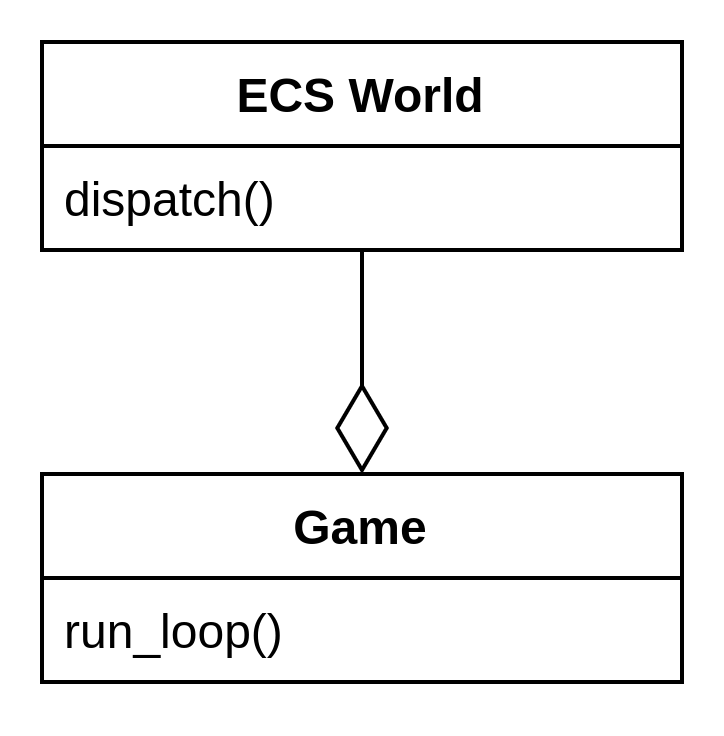

# Компонентная система игры

В этом документе описана компонентная система, используемая для
представления игровых объектов и обработки логики.

## Мотивация

Основная мотивация для использования компонентной системы в игровой разработке — это достижение модульности, гибкости и переиспользуемости кода. Компонентная система позволяет отделить данные от поведения, что упрощает добавление новых и изменение существующих функций без изменения структуры кода. Это особенно полезно в условиях постоянно меняющихся требований в игровом разработке, где необходимо быстро тестировать новые идеи и функции.

## Требования

Система должна реализовывать паттерн Entity Component System ([ECS](https://en.wikipedia.org/wiki/Entity_component_system)).

В частности:

- динамическое добавление и удаление компонентов игровых объектов во время выполнения
- должна быть поддержка сериализации-десериализации, чтобы сохранять и загружать состояние игры

Технические требования:

- язык Rust, поставка в виде Crate

Не такие важные требования:

- производительность ECS не является основным требованием, так как сложность игры ограничена размером терминала
и константным объемом дополнительной информации. Даже наивной реализации будет достаточно.

## Дизайн

В качестве ECS для игры мы выбрали [specs](https://crates.io/crates/specs).

Пример из документации:

```rust
extern crate specs;

use specs::prelude::*;

// A component contains data which is associated with an entity.

#[derive(Debug)]
struct Vel(f32);

impl Component for Vel {
    type Storage = VecStorage<Self>;
}

#[derive(Debug)]
struct Pos(f32);

impl Component for Pos {
    type Storage = VecStorage<Self>;
}

struct SysA;

impl<'a> System<'a> for SysA {
    // These are the resources required for execution.
    // You can also define a struct and `#[derive(SystemData)]`,
    // see the `full` example.
    type SystemData = (WriteStorage<'a, Pos>, ReadStorage<'a, Vel>);

    fn run(&mut self, (mut pos, vel): Self::SystemData) {
        // The `.join()` combines multiple components,
        // so we only access those entities which have
        // both of them.
        // You could also use `par_join()` to get a rayon `ParallelIterator`.
        for (pos, vel) in (&mut pos, &vel).join() {
            pos.0 += vel.0;
        }
    }
}

fn main() {
    // The `World` is our
    // container for components
    // and other resources.

    let mut world = World::new();

    // This builds a dispatcher.
    // The third parameter of `add` specifies
    // logical dependencies on other systems.
    // Since we only have one, we don't depend on anything.
    // See the `full` example for dependencies.
    let mut dispatcher = DispatcherBuilder::new().with(SysA, "sys_a", &[]).build();

    // setup() must be called before creating any entity, it will register
    // all Components and Resources that Systems depend on
    dispatcher.setup(&mut world);

    // An entity may or may not contain some component.

    world.create_entity().with(Vel(2.0)).with(Pos(0.0)).build();
    world.create_entity().with(Vel(4.0)).with(Pos(1.6)).build();
    world.create_entity().with(Vel(1.5)).with(Pos(5.4)).build();

    // This entity does not have `Vel`, so it won't be dispatched.
    world.create_entity().with(Pos(2.0)).build();

    // This dispatches all the systems in parallel (but blocking).
    dispatcher.dispatch(&world);
}
```

Загрузка и сохранение происходят с помощью модуля [saveload](https://docs.rs/specs/0.20.0/specs/saveload/index.html),
опирающегося на [serde](https://serde.rs/).

Состояние игры будет содержаться в структуре `Game`, содержащей в себе в том числе одно из возможных состояний, определяющих то, что видит пользователь:

- `Menu` - основное меню, которое пользователь видит на старте
- `Game` - непосредственно процесс игры

Обновление состояния игры будет выполняться в game-loop, реализованном в структуре `Game`.



## Альтернативы

### Альтернативные реализации ECS

Достаточно полный список ECS представлен на https://arewegameyet.rs/ecosystem/ecs/

Из альтернатив стоит выделить:

- Самостоятельное написание ECS. Можно, но трудозатратно. Мы находимся в условиях хакатонинга,
  поэтому такая опция нам не доступна.
- [bevy_ecs](https://docs.rs/bevy_ecs/latest/bevy_ecs/). Является частью игрового фреймворка [bevy](https://bevyengine.org/).
  Не выбираем, так как тогда придется погрузиться в движок, а его [документация](https://bevyengine.org/learn/quick-start/introduction/) предполагает в основном изучение на [примерах](https://github.com/bevyengine/bevy/tree/latest/examples#examples), каковых достаточно много. На изучение уйдёт много времени.

### Альтернативные паттерны

- Подход ООП. Не рассматриваем, так как в играх, где есть понятия "существа" и "свойства"
  ООП будет предполагать большое количество наследований (например, `{movable,attacking,item-owning}->creature->{hero,enemy}`
  усложняется при добавлении существ, которые не атакуют `{..}->creature->{..}; {creature,+attacking}->attacking_creature`).
  При добавлении новых игровых механик появляется риск возникновения сложной иерархии объектов. В Rust такое сделать непросто.

- Отсутствие паттерна. Не рассматриваем, потому что не хотим изобретать велосипед.
