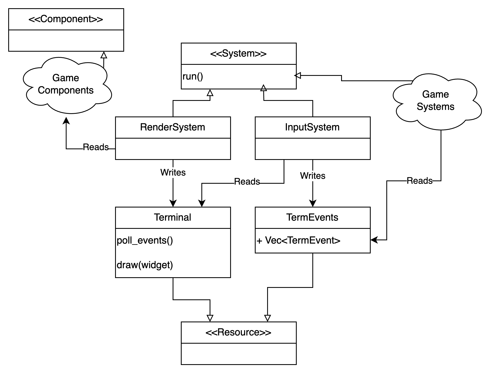

# Отрисовка и взаимодействие с игроком

В этом документе описана система отрисовки, используемая для
отображения игры в терминале и обработки действий пользователя.

## Мотивация

При создании текстовых интерфейсов для игр важно использовать систему отрисовки, которая будет не только интегрироваться с терминалом, но и позволять описывать графические интерфейсы.

## Требования

- консольная графика
- цвета в терминале
- использование unicode
- возможность отображать объекты размером больше одного символа
- обработка нажатий клавиш
- потенциальная возможность замены на другой движок

### Nice to have

- поддержка wasm (никто в 2024 не будет запускать локально, а встроить реализованную игру себе на личный сайт всегда приятно!)

## Дизайн

Для отрисовки мы решили использовать библиотеку [ratatui](https://ratatui.rs/) (де-факто стандартную
для создания TUI приложений на Rust).

Отрисовка должна быть отделима от самого состояния игры. Мы закладываем в архитектуру принцип: **содержимое мира ECS ничего не знает про отрисовку**. То есть `view = f(ECS World)`.

Тем не менее, удобно выделить саму систему отрисовки в виде отдельной ECS системы `RenderSystem`, которая на каждый тик игры будет
читать текущее состояние мира и отображать его.

Для взаимодействия с платформой выделим ресурс `Terminal`, абстрагирующий состояние ratatui.

Для обработки событий выделим отдельную систему `InputSystem`, которая будет забирать из `Terminal` очередную партию
событий (действий игрока) и сохранять их в ресурс `TermEvents`, который будет доступен всем остальным системам для чтения.

## Альтернативы

- можно завести компонент `Renderable`, хранящий в себе реализацию некоторого интерфейса для отрисовки. Не делаем так, потому что

    1) не хотим делать что-то с Z-координатой для упорядочивания отрисовки объектов
    2) такой подход потребует заведения новой компоненты при необходимости смены системы отрисовки, однако ECS не будет запрещать создавать старые `Renderable` компоненты

- можно воспользоваться более низкоуровневой библиотекой [crossterm](https://docs.rs/crossterm/latest/crossterm/), однако для неё мы не нашли возможности отрисовки в wasm (а для ratatui [нашли](https://docs.rs/webatui/latest/webatui/))
