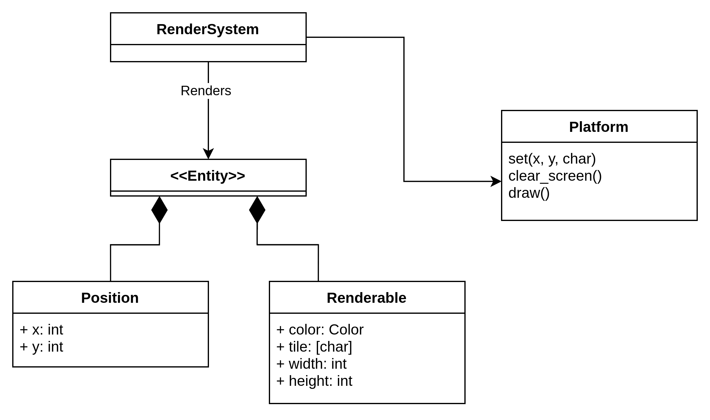

# Отрисовка и взаимодействие с игроком

В этом документе описана система отрисовки, используемая для
отображения игры в терминале и обработки действий пользователя.

## Мотивация

При создании текстовых интерфейсов для игр важно использовать систему отрисовки, которая будет не только интегрироваться с терминалом, но и позволять описывать графические интерфейсы.

## Требования

- консольная графика
- цвета в терминале
- использование unicode
- возможность отображать объекты размером больше одного символа
- обработка нажатий клавиш

### Nice to have

- поддержка wasm (никто в 2024 не будет запускать локально, а встроить реализованную игру себе на личный сайт всегда приятно!)

## Дизайн

Для отрисовки мы решили использовать библиотеку [ratatui](https://ratatui.rs/) (де-факто стандартную
для создания TUI приложений на Rust).

Так как мы решили, что используем паттерн ECS для реализации игры, опишем связанные компоненты
:

- `Position` - показывает где находится объект на карте
- `Renderable` - хранит информацию о том, как отобразить объект пользователю. Содержит данные тайла в виде utf-8 текста, а также хранит ширину и высоту (ширина и высота в произведении должны давать длину текста).

Для взаимодействия с платформой выделим синглтон `Platform` (в ECS он будет представлять собой Resource), абстрагирующий состояние ratatui. Также сделаем систему отрисовки:

- `RenderSystem` - на каждый тик проходит по всем `Renderable+Position` entities в игровом мире и отрисовывает их через `Platform`.

Также через платформу будет отрисовываться информация о игре другими системами.

## Альтернативы

- можно воспользоваться более низкоуровневой библиотекой [crossterm](https://docs.rs/crossterm/latest/crossterm/), однако для неё мы не нашли возможности отрисовки в wasm (а для ratatui [нашли](https://docs.rs/webatui/latest/webatui/))
